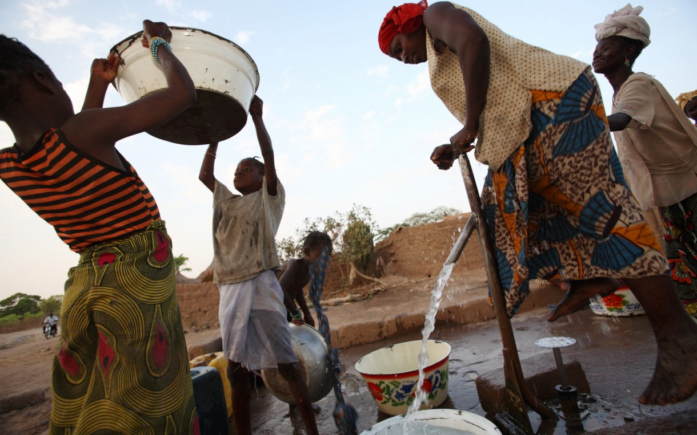
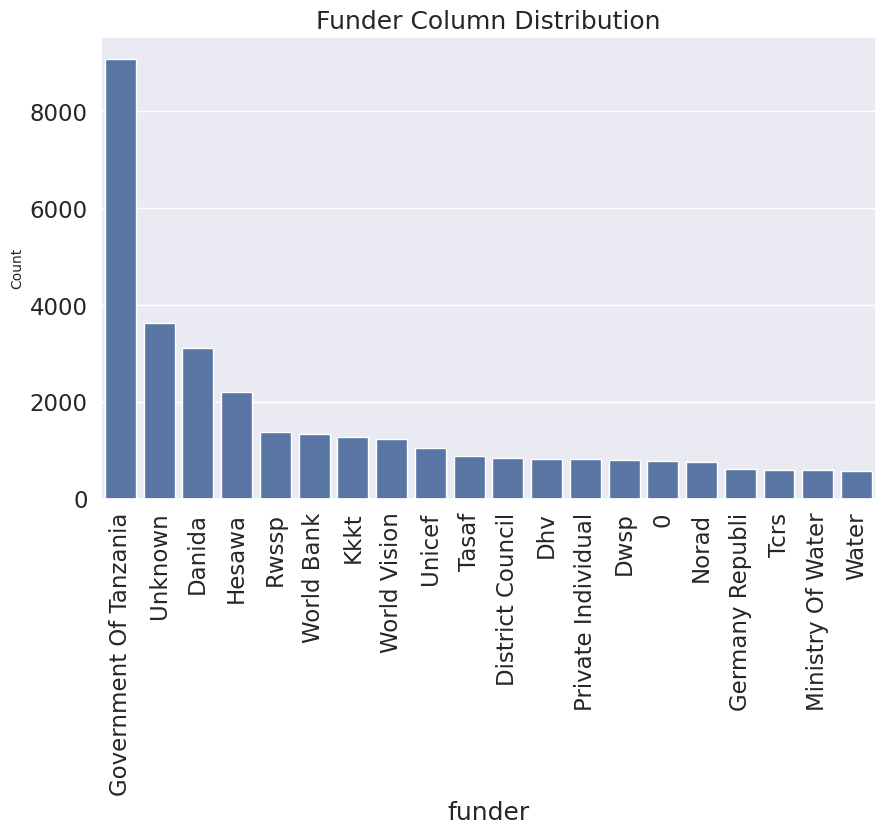
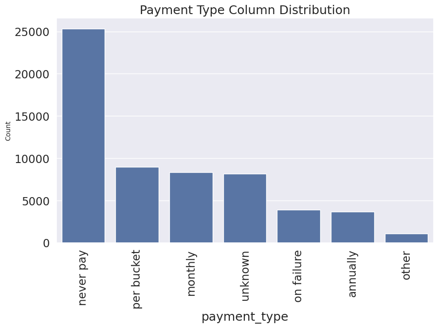
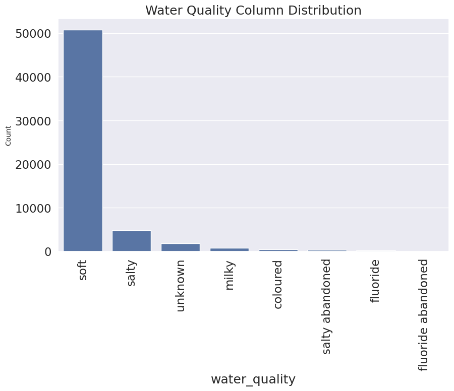
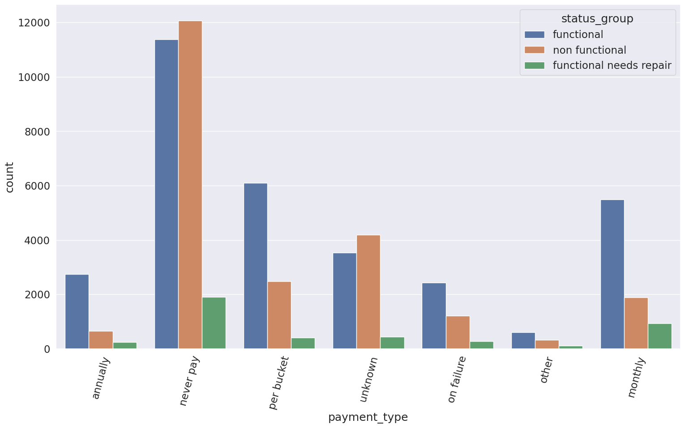

# Water Pump Operational Status Prediction

## Overview
This project aims to predict the operational status of water pumps across Tanzania using machine learning. By leveraging structured data, we seek to enhance decision-making in water infrastructure management, ensuring efficient maintenance and resource allocation.

## Business and Data Understanding
Access to clean water is crucial for public health and sustainable development. This project serves stakeholders such as the government and NGOs, who are responsible for maintaining and repairing water points. By predicting pump functionality, they can prioritize interventions and allocate resources efficiently. The dataset includes features like pump characteristics, geographic locations, and historical maintenance records.

The dataset contains detailed information on waterpoints across Tanzania, capturing a variety of features that may influence the operational status of each waterpoint. These features range from geographic details to waterpoint characteristics, such as funding source, installation details, water quality, and management practices.

Below are some of the findings after exploratory data analysis:

Our pie chart indicates that around 55% of water pumps are fully functional, 7% are operational but require repairs, and 38% are non-functional.

Most wells in Tanzania are funded by the Government of Tanzania

Most people access water from wells without payment, likely because these wells are intended for community benefit rather than profit.

Soft water lacks calcium and magnesium salts, which in excess can be harmful to both health and homes. Examples include rainwater and distilled water. Our visualization shows that communities in Tanzania primarily consume soft water.

Most of the functional and non functional water pumps are never paid for, again this might be because of the fact that they are communal

## Modeling
We utilize **XGBoost** to predict the operational status of water pumps in Tanzania due to its efficiency, robustness, and superior performance over **Random Forest**. XGBoost delivers **79.91% accuracy**, a **7% improvement** over RF, while also achieving **better recall (76% vs. 54%)** and **stronger generalization** (Macro F1: **0.68**, Weighted F1: **0.79**). These metrics demonstrate its ability to produce **balanced and reliable predictions**, which are crucial for identifying pumps that need maintenance.  

To optimize performance, we fine-tune key hyperparameters such as **n_estimators, max_depth, learning rate, alpha, and lambda**, leveraging **Grid Search or Random Search with cross-validation**. This fine-tuning process enhances the model's ability to **prevent overfitting, improve accuracy, and generalize well across diverse datasets**. By using a data-driven approach, our model can help **prioritize water pump repairs, optimize resource allocation, and contribute to sustainable water management** in Tanzania.

## Evaluation
The model’s performance was evaluated using accuracy, precision, recall, and F1-score to ensure reliable predictions. XGBoost demonstrated 79.91% accuracy, a 7% improvement over Random Forest, and significantly better recall (76% vs. 54%) for identifying non-functional water pumps. With a Macro F1-score of 0.68 and a Weighted F1-score of 0.79, XGBoost provided more balanced predictions across all classes. This strong performance makes it a valuable tool for proactive maintenance planning, enabling authorities to prioritize repairs, allocate resources efficiently, and improve access to clean water in Tanzania.

## Conclusions
---
### **Enhancing Water Access Through Predictive Maintenance**  

● **Optimizing Water Resource Management**  
By accurately predicting the operational status of water pumps, this model provides **critical insights** for government agencies, NGOs, and local authorities, enabling **data-driven decisions** to improve water infrastructure.  

● **Proactive Maintenance & Resource Allocation**  
Identifying pumps at risk of failure allows stakeholders to **proactively plan maintenance**, **allocate resources efficiently**, and **prioritize repairs** before breakdowns occur. This minimizes downtime and ensures continuous access to clean water.  

● **Ensuring Reliable Water Supply for Communities**  
By reducing disruptions in water access, the model helps guarantee that communities, especially those in remote or underserved areas, **have a reliable supply of clean water** for their daily needs.  

● **Long-Term Sustainability & Infrastructure Planning**  
The model aids in tracking pump performance trends, implementing preventive maintenance strategies, and **optimizing infrastructure investments**, ensuring a more **sustainable** approach to water management.  

● **Advancing Public Health & Water Security**  
By reducing water pump failures and improving access to clean water, this predictive approach contributes to **better public health**, **reduces water scarcity**, and supports efforts toward **sustainable water access for all**.

## **Next Steps**  
---  
● **Expand Model Deployment**  
Integrate the predictive model into government and NGO systems to facilitate real-time monitoring of water pump conditions, improving maintenance response times.  

● **Enhance Data Collection & Quality**  
Refine data sources by incorporating IoT sensors and community reports to improve model accuracy and ensure more reliable predictions.  

● **Develop a User-Friendly Dashboard**  
Create an interactive dashboard for stakeholders to visualize pump statuses, maintenance priorities, and resource allocation needs.  

● **Conduct Field Validation & Testing**  
Verify model predictions with on-the-ground assessments to measure real-world effectiveness and refine predictive accuracy.  

● **Scale to Other Regions**  
Adapt the model for use in other regions facing water access challenges, ensuring broader impact on sustainable water resource management.  

● **Integrate with Preventive Maintenance Strategies**  
Collaborate with policymakers to implement preventive maintenance schedules based on model insights, reducing long-term infrastructure costs.

## **For More Information**
---

See the full analysis in the [jupyter notebook](./Aviation_Accidents_Analysis.ipynb) or review this [Presentation](./presentation.pdf).

For additional info, contact Roy Njuguna at roynjuguna222@gmail.com

## **Repository Structure**
|── data

├── images

├── README.md

├── NTSB-Aviation-Accidents-Analysis-Presentation.pdf

└── NTSB-Aviation-Accidents-Analysis.ipynb

