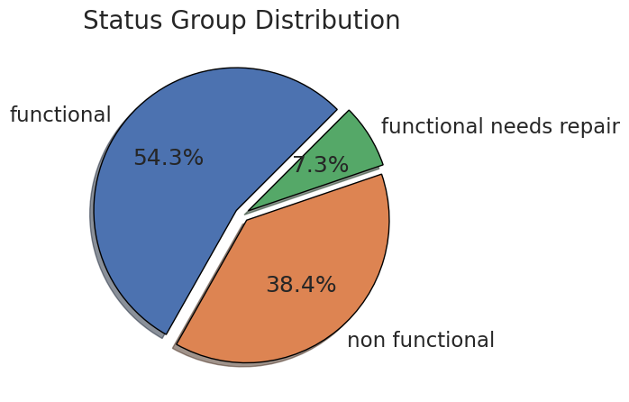

# Water Pump Operational Status Prediction

## Overview
This project aims to predict the operational status of water pumps across Tanzania using machine learning. By leveraging structured data, we seek to enhance decision-making in water infrastructure management, ensuring efficient maintenance and resource allocation.

## Business and Data Understanding
Access to clean water is crucial for public health and sustainable development. This project serves stakeholders such as the government and NGOs, who are responsible for maintaining and repairing water points. By predicting pump functionality, they can prioritize interventions and allocate resources efficiently. The dataset includes features like pump characteristics, geographic locations, and historical maintenance records.

The dataset contains detailed information on waterpoints across Tanzania, capturing a variety of features that may influence the operational status of each waterpoint. These features range from geographic details to waterpoint characteristics, such as funding source, installation details, water quality, and management practices.

Below are some of the findings after exploratory data analysis:

Our pie chart indicates that around 55% of water pumps are fully functional, 7% are operational but require repairs, and 38% are non-functional.

Most wells in Tanzania are funded by the Government of Tanzania

Most people access water from wells without payment, likely because these wells are intended for community benefit rather than profit.

soft water lacks calcium and magnesium salts, which in excess can be harmful to both health and homes. Examples include rainwater and distilled water. Our visualization shows that communities in Tanzania primarily consume soft water.

Most of the functional and non functional water pumps are never paid for, again this might be because of the fact that they are communal

## Modeling
We utilize **XGBoost** to predict the operational status of water pumps in Tanzania due to its efficiency, robustness, and superior performance over **Random Forest**. XGBoost delivers **79.91% accuracy**, a **7% improvement** over RF, while also achieving **better recall (76% vs. 54%)** and **stronger generalization** (Macro F1: **0.68**, Weighted F1: **0.79**). These metrics demonstrate its ability to produce **balanced and reliable predictions**, which are crucial for identifying pumps that need maintenance.  

To optimize performance, we fine-tune key hyperparameters such as **n_estimators, max_depth, learning rate, alpha, and lambda**, leveraging **Grid Search or Random Search with cross-validation**. This fine-tuning process enhances the model's ability to **prevent overfitting, improve accuracy, and generalize well across diverse datasets**. By using a data-driven approach, our model can help **prioritize water pump repairs, optimize resource allocation, and contribute to sustainable water management** in Tanzania.

## Evaluation
The model’s performance was evaluated using accuracy, precision, recall, and F1-score to ensure reliable predictions. XGBoost demonstrated 79.91% accuracy, a 7% improvement over Random Forest, and significantly better recall (76% vs. 54%) for identifying non-functional water pumps. With a Macro F1-score of 0.68 and a Weighted F1-score of 0.79, XGBoost provided more balanced predictions across all classes. This strong performance makes it a valuable tool for proactive maintenance planning, enabling authorities to prioritize repairs, allocate resources efficiently, and improve access to clean water in Tanzania.

## Conclusion
By accurately predicting the operational status of water pumps, this model provides **critical insights** that can support government agencies, NGOs, and local authorities in making **data-driven decisions** for water resource management. By identifying pumps at risk of failure, stakeholders can **proactively plan maintenance**, allocate resources more effectively, and **prioritize repairs** before breakdowns occur. This reduces downtime, minimizes disruptions in water access, and ensures that communities, especially those in remote or underserved areas, **have a reliable supply of clean water**. Additionally, the model enhances **long-term sustainability** by helping organizations track pump performance trends, implement preventive maintenance strategies, and optimize infrastructure investments. Ultimately, this predictive approach contributes to **improving public health, reducing water scarcity, and advancing efforts toward sustainable water access for all.**

